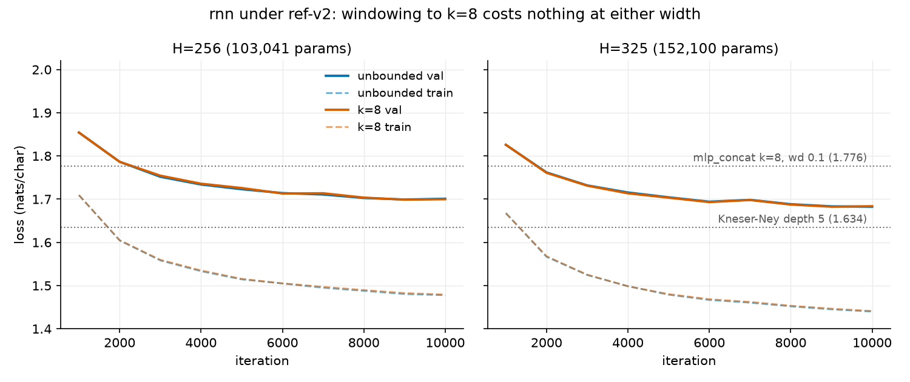

# 001: rnn vs mlp_concat k=8 under ref-v2 - report

All numbers are means over seeds 0/1/2 from this directory's runs.jsonl (12 rows, all at commit 8646393, `git_dirty: false`); +/- is the half-range across seeds.
Comparators from the frozen page-2 record: `mlp_concat` k=8 at wd 0.1 alone, best 1.776 +/- .005 (train/val 1.506/1.781, gap 0.275), ladder optimum k=5 at 1.772, KN at 1.634.

## Result

| cell | params | train / val | best +/- | @iters | gap | vs concat 1.776 |
|---|---|---|---|---|---|---|
| unbounded, H=256 | 103,041 | 1.478 / 1.701 | 1.6967 +/- .004 | 9,10,8k | 0.223 | -0.079 |
| k=8, H=256 | 103,041 | 1.479 / 1.700 | 1.6954 +/- .009 | 9,10,10k | 0.221 | -0.081 |
| unbounded, H=325 | 152,100 | 1.440 / 1.682 | 1.6796 +/- .012 | 9,10,10k | 0.242 | -0.096 |
| k=8, H=325 | 152,100 | 1.441 / 1.684 | **1.6796** +/- .013 | 9,9,10k | 0.243 | -0.096 |

The figure is the finding: at both widths the k=8 and unbounded curves are indistinguishable, train and val alike.

## Verdict per prediction

1. Confirmed: unbounded H=256 landed at 1.6967, inside [1.68, 1.77] (0.017 above the bottom edge) and above KN's 1.634.
2. Confirmed: 1.6967 beats concat k=8's 1.776 by 0.079, well past the required 0.01.
3. Confirmed, emphatically: rnn k=8 H=256 (1.6954) retains 102% of the unbounded margin (0.081 vs 0.079), not merely the predicted half.
4. REFUTED, in the informative direction: the context price is -0.001 at H=256 and -0.000 at H=325, below the predicted [0.01, 0.05]; chars 9-32 are worth nothing here.
5. Mixed: all four gaps (0.221-0.243) sit below concat's 0.275 as predicted, but the unbounded H=256 gap (0.223) misses its [0.08, 0.22] band by 0.003.
6. Confirmed: width buys 0.017 (unbounded) and 0.016 (k=8), inside [0.00, 0.03].
7. Mixed - the riskiest call overshot its own band: at matched params and matched context, rnn k=8 H=325 wins by 0.096, above the predicted [0.02, 0.08].
   The feared mechanism (wd 0.1 buys concat what the rnn gets implicitly, collapsing the gap) ran exactly backwards: the page-1 ~0.05 matched-params gap roughly doubled under the regularized protocol.

## Per-hypothesis readings

- H1 (weight sharing): the surviving explanation among those tested.
  At matched context and matched params the win is 0.096; even spotting concat a 1.5x parameter advantage (103k vs 152k) the rnn wins by 0.081.
- H2 (unbounded context): refuted as a mechanism for the win; windowing to concat's exact reach costs nothing at either width.
  Caveat: "unbounded" still means the 32-char training window, so this prices chars 9-32, not arbitrarily deep context.
- H4 (implicit regularization): present but minor.
  Every rnn gap is below concat's 0.275, but at matched params the difference is only 0.033 (0.242 vs 0.275) and rnn gaps grow with width (0.221-0.223 at H=256 -> 0.242-0.243 at H=325), so less overfitting cannot account for a 0.096 val margin.
  The win reads as better inductive bias per parameter, not better regularization.
- H3 (soft back-off off-support): untested here by design; the rnn won, so the per-d-bucket rnn-vs-KN anatomy is now the standing follow-up.
- H5 (depth of composition): untested and still confounded with H1; the k=8 window applies up to 8 shared nonlinear steps where concat gets one wide layer.
  Separating them would take a deep per-offset model (e.g. a 2-3 layer concat MLP at matched params).

## Operational notes

- best_iter pinned at 10k in 5 of 12 runs (val still falling at the budget boundary), the same boundary page 2 flagged for concat; the expected residual there was <= 0.01.
- Wall time: 83.8 minutes of compute for all 12 runs, single process on the local worker (the issue's estimate was 1-2h for 6 runs).
  Per run: ~3.3 min unbounded H=256, ~7.5 min k=8 H=256, ~5.8 min unbounded H=325, ~10-12 min k=8 H=325.
  The windowed path is ~2.2x slower per iteration than unbounded despite 4x fewer python-loop steps (it does 8x the matmul rows).
  Provenance footnote: the `ts` deltas between rows 5-7 include ~66 minutes of system sleep (lid close; `caffeinate -i` only blocks idle sleep); the worker's 83.8 min is `time.monotonic()`, which excludes sleep on macOS.

## Conclusion / next steps

The rnn displaces `mlp_concat` as the best neural model at ref-v2 scale: 1.680 at H=325 (context_k moot), cutting KN's margin from 0.135 to 0.046 nats.
The page-1 learning #15 strengthens rather than survives: weight sharing's edge is not a scarcity artifact and not a regularization artifact, and it grows with scale under wd.
Context depth beyond 8 chars is worth nothing to the rnn at this scale, consistent with the KN ladder's finding that value concentrates in the recent suffix.

Next, in order of information value:

- Per-d-bucket rnn-vs-KN anatomy (H3): does contractive recurrence show KN's off-support robustness where concat collapsed (+0.434 at d<=3)?
- lstm at ref-v2: the gate tax amortized by 60k params at std-v1, so at 103-152k the lstm may pass the rnn.
- attention at ref-v2, completing the deferred scale-up.
- Optional: H5 disambiguation via a deep concat MLP; 20k-iter check for the boundary-pinned cells.
